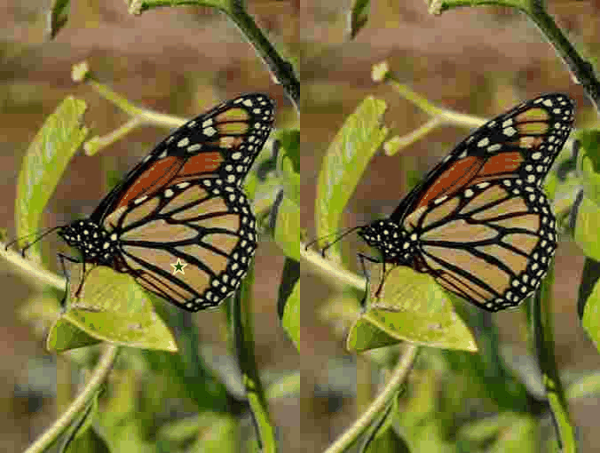

<p align="center">
  
</p>

**Brief intro**: Enhance and restore anything continuously with [Segment Anything Model](https://github.com/facebookresearch/segment-anything) and [CResMD](https://github.com/hejingwenhejingwen/CResMD) (The initial version, and it will be extended in future).

**Purpose**: We aim to achieve a unfied intellignet image/video PS/enhancement framework. More functions will be developed.

## 🌟 Enhance Anything Features
- [x] **Continuously Enhance** Anything by a simple click
- [ ] Assist Colorizing Anything
- [ ] Assist multiple distortion types
- [ ] Assist multiple enhancement types
- [ ] Technique Analysis - Arxiv Version
- [ ] Demo
- [ ] Improving generalization capability


## Visual Examples

### Enhance zebra continuously
<p align="center">
    
</p>


### Enhance dog and chair continuously
<p align="center">
    
</p>


### Enhance dog continuously
<p align="center">
    
</p>


### Enhance butterfly continuously 

<p align="center">
    
</p>


## Usages
Please download the weights for [segment-anything](https://dl.fbaipublicfiles.com/segment_anything/sam_vit_h_4b8939.pth), and move it to ./pretrained_weights. Then you can run the code with:
```
 python enhance_anything_continusly.py  --input_img ./examples/0006.png    --point_coords 200 300    --point_labels 1     --dilate_kernel_size 30     --output_dir ./results     --sam_model_type "vit_h"     --sam_ckpt ./pretrained_models/sam_vit_h_4b8939.pth --opt ./CResMD/options/test/modulation_CResMD.yml
```
The results are shown in ./results_continuous/. 

## Environment
```bash
conda create -n seganything python
python -m pip install torch torchvision torchaudio
python -m pip install -e segment_anything
python -m pip install lmdb
```

## Acknowledgments
- [Segment Anything](https://github.com/facebookresearch/segment-anything)
- [Inpainting Anything](https://github.com/geekyutao/Inpaint-Anything)
- [CResMD](https://github.com/hejingwenhejingwen/CResMD)
